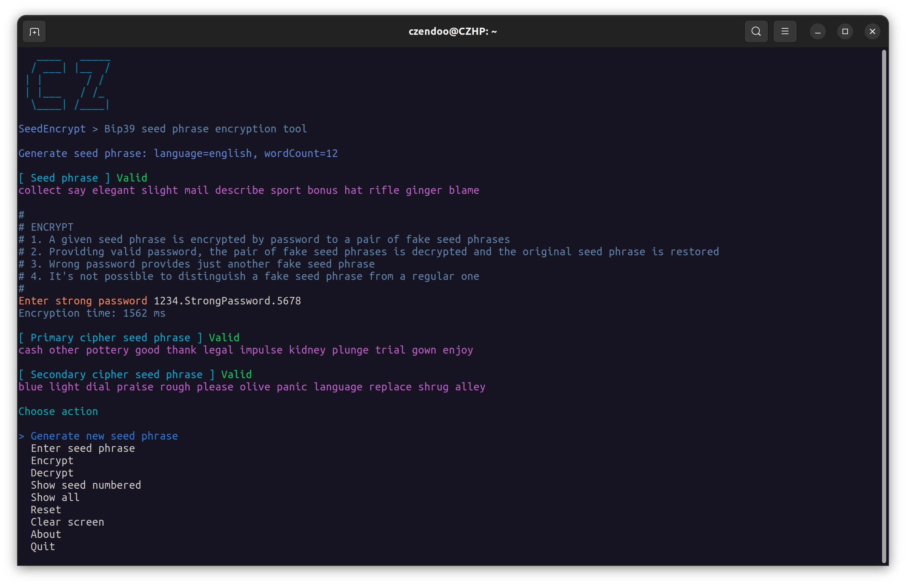

# SeedEncrypt
## The bep39 seed phrase encryption tool
- A given seed phrase is encrypted by password to a pair of fake seed phrases
- Providing valid password, the pair of fake seed phrases is decrypted and the original seed phrase is restored
- Wrong password provides just another fake seed phrase
- It's not possible to distinguish a fake seed phrase from a regular one
- It's not possible to detect if the fake seed phrases are a result of encryption

# Getting Started
TODO: Guide users through getting your code up and running on their own system. In this section you can talk about:
1.	Installation process
2.	Software dependencies
3.	Latest releases
4.	API references

# Build and Test
TODO: Describe and show how to build your code and run the tests. 

# Contribute
TODO: Explain how other users and developers can contribute to make your code better. 

If you want to learn more about creating good readme files then refer the following [guidelines](https://docs.microsoft.com/en-us/azure/devops/repos/git/create-a-readme?view=azure-devops). You can also seek inspiration from the below readme files:
- [ASP.NET Core](https://github.com/aspnet/Home)
- [Visual Studio Code](https://github.com/Microsoft/vscode)
- [Chakra Core](https://github.com/Microsoft/ChakraCore)